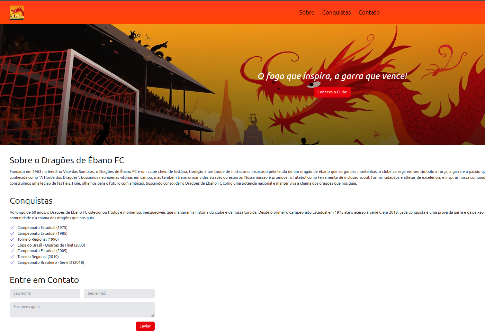

# Dragões do Ébano FC - Single Page

This is a simple project built using HTML and TailwindCSS, featuring a single-page website about the fictional football team "Dragões do Ébano FC." The story and content of the team were created with the help of DeepSeek, an AI-powered tool that generated an engaging narrative about the club.

This project was developed in just a few hours as part of a training exercise over the weekend.

## Technologies Used

- **HTML**: The basic structure of the page.
- **TailwindCSS**: A utility-first CSS framework used to style the page quickly and responsively.
- **DeepSeek**: The AI tool that helped generate the story of the fictional team.

## Screenshot

## Overview

The single-page website includes:

- A **welcome section** with a brief description of the team and its motto.
- **Major accomplishments**: A list of the team's victories and milestones.
- **Contact form**: For fans to reach out to the team.

## Contributing

Feel free to contribute improvements, suggestions, or fixes by opening a **pull request** or creating an **issue**.

## License

This project is open source under the MIT license. Feel free to use and modify the code for your own projects.
